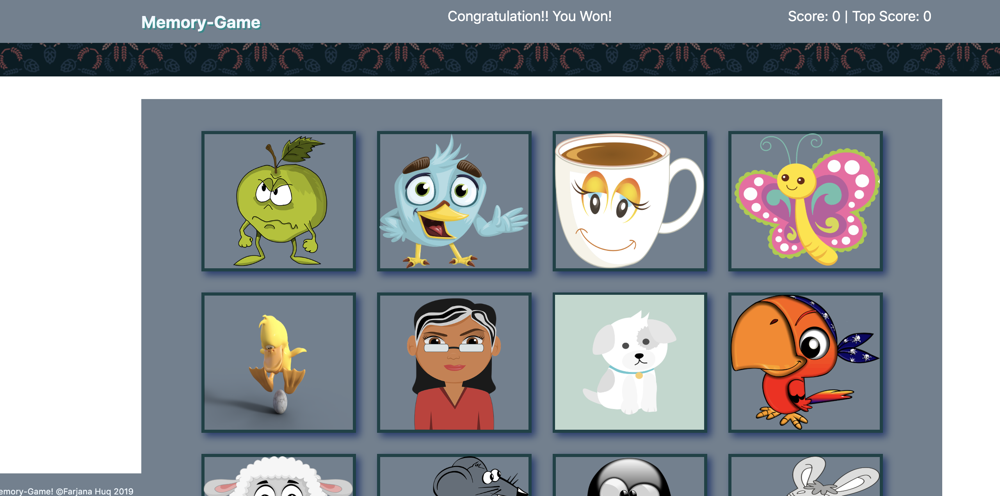

# MemoryGame-React.Js
* First, click on any image to begin the game.

* If you click on different images, the score and top score will keep increamenting high.

* If you click on the same image, then your score will go down to zero, but the top score will display
the highest score you made.

* If you click more than the guess limit (10), and cannot reach the top score, you then will loose the game.

* If you reach the top score and guess limit (10), you will win the game.
